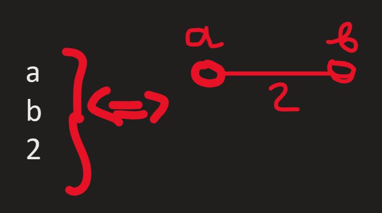

# Discrete-mathematics - My Projects Lab

## Запуск
Чтобы запустить алгоритм на своей машине, просто скопируйте репозиторий или скачайте отдельный нужный вам файл.

## Алгоритмы
### 1. Minimum spanning tree

Запускаете единственный файл с расширением .py(MyMST.py) и вы получите алгоритм Краскала. 
**Сам алгоритм** - <a href="https://ru.wikipedia.org/wiki/%D0%90%D0%BB%D0%B3%D0%BE%D1%80%D0%B8%D1%82%D0%BC_%D0%9A%D1%80%D0%B0%D1%81%D0%BA%D0%B0%D0%BB%D0%B0">алгоритм на вики<a/>
  
#### Ввод данных в MST:
1. Сначало нужно указать количество ребер(E) 
2. Потом как на картинке каждое ребро таким образом:

#### Вывод данных в MST:
1. Вы получаете общую длину полученного дерера.
2. Вы получаете все ребра которые входят в дерево.

### 2. Method Lemera (pseudo-random numbers)
**Сам алгоритм** - <a href="https://ru.wikipedia.org/wiki/%D0%9B%D0%B8%D0%BD%D0%B5%D0%B9%D0%BD%D1%8B%D0%B9_%D0%BA%D0%BE%D0%BD%D0%B3%D1%80%D1%83%D1%8D%D0%BD%D1%82%D0%BD%D1%8B%D0%B9_%D0%BC%D0%B5%D1%82%D0%BE%D0%B4">алгоритм на вики<a/>
  
#### Ввод данных в Method Lemera:
1. Сначало нужно указать k 
2. Потом нужно указать r: 
3. Далее необходимо число x0:    
4. Вводим нужное нам количество "случайных" чисел.

#### Вывод данных в Method Lemera:
1. Вывод по очереди введенное в (4) пункте ввода количество "случайный" чисел.
